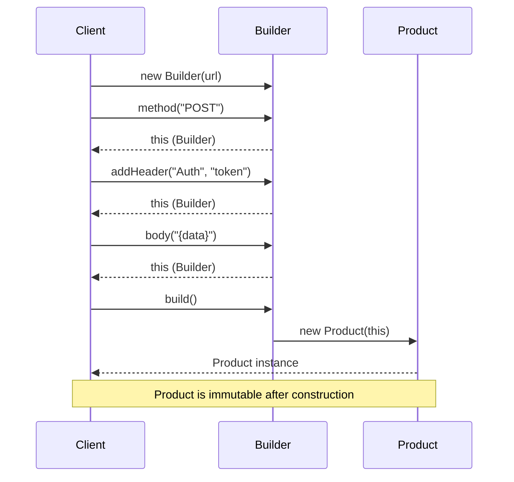

# Builder Pattern Foundation

> [!tldr]
> Construct complex objects step by step using method chaining, never exposing a half built state.

Part of [[builder]].

---

## The problem

An object requires many constructor parameters, some optional, leading to the messy `new Order("Rahul", null, null, true, "123 Main st")` anti pattern.

---

## The solution

Construct complex objects step by step using method chaining, returning `this`.

---

## Before and after

**Before, the telescoping constructor.**

```ts
const req = new HttpRequest(
  url,        // url
  method,     // method
  headers,    // headers
  null,       // body
  null,       // queryParams
  30000       // timeoutMs
);
```

**After, the builder.**

```ts
const req = new HttpRequest.Builder(url)
  .method("POST")
  .addHeader("key", "val")
  .build();
```

---

## The two ideas that define the pattern

1. **Step by step construction.** Instead of passing everything to a constructor at once, you set each field through individual method calls. You only call the methods for the fields you need.
2. **Fluent interface.** Each setter returns the builder itself, so you can chain calls into a single readable expression ending with `build()`.

The pattern separates the construction of a complex object from its representation, allowing the same construction process to create different configurations.

---

## The shape

```ts
class ClassForBuilding {
    // properties
    private constructor(builder) { /* ... */ }

    // methods

    static Builder = class {
        // properties

        constructor(/* args passed by the caller */) { }

        // setters: modify this, return this

        build(): ClassForBuilding {
            return new ClassForBuilding(this);
        }
    }
}
```

---

## The execution flow

There are three actors: the client, the builder, and the main class.

```text
[CLIENT]                               [BUILDER]                             [MAIN CLASS]
   |                                       |                                      |
   | 1. new MainClass.Builder()            |                                      |
   |-------------------------------------->|                                      |
   |                                       | (Creates empty Builder object)       |
   | 2. returns Builder instance           |                                      |
   |<--------------------------------------|                                      |
   |                                       |                                      |
   | 3. .setFieldA("value")                |                                      |
   |-------------------------------------->|                                      |
   |                                       | (Saves "value" in Builder)           |
   | 4. returns `this` (Builder)           |                                      |
   |<--------------------------------------|                                      |
   |                                       |                                      |
   | 5. .setFieldB("value")                |                                      |
   |-------------------------------------->|                                      |
   |                                       | (Saves "value" in Builder)           |
   | 6. returns `this` (Builder)           |                                      |
   |<--------------------------------------|                                      |
   |                                       |                                      |
   | 7. .build()                           |                                      |
   |-------------------------------------->|                                      |
   |                                       | 8. new MainClass(this)               |
   |                                       |------------------------------------->|
   |                                       |                                      |
   |                                       |        (Copies data from Builder)    |
   |                                       |        (Creates final Object)        |
   |                                       |                                      |
   |                                       | 9. returns MainClass instance        |
   |                                       |<-------------------------------------|
   | 10. returns MainClass instance        |                                      |
   |<--------------------------------------|                                      |
   |                                       |                                      |
  DONE                                    TRASH (Builder is discarded)           LIVE
```

The same flow as a sequence, with a real HTTP request being built:



### The five phases

**Phase 1, instantiation, steps 1 and 2.** You create the builder. The main class does not exist yet. The builder is a temporary bucket to hold your configuration.

**Phase 2, configuration and chaining, steps 3 to 6.** You call methods on the builder. It saves the data inside itself, and crucially every setter ends with `return this;`, which is what enables method chaining.

**Phase 3, the hand off, steps 7 and 8.** You call `.build()`. The builder calls `new MainClass(this)`, passing itself into the main class's private constructor.

**Phase 4, the lockdown, step 9.** The main class constructor executes, looks at the builder that was passed to it, and strictly copies all the values over to its own `readonly` fields.

**Phase 5, delivery, step 10.** The fully populated main class is returned to the client. The temporary builder is now useless and gets garbage collected.

> [!tip] Why we do it this way
> This flow guarantees that the main class is never seen in a half built state. The builder acts as a holding area until all data is ready, then creates the final object in one single atomic step.

---

## A simple builder

```js
class OrderBuilder {
    constructor() {
        this.order = { items: [] };
    }

    setUser(user) {
        this.order.user = user;
        return this; // crucial for chaining
    }

    addItem(item) {
        this.order.items.push(item);
        return this;
    }

    build() {
        // final validation happens here, before returning
        if (!this.order.user) throw new Error("Order must have a user");
        return this.order;
    }
}

const finalOrder = new OrderBuilder()
    .setUser("Rahul")
    .addItem("Laptop")
    .build();
```

---

## A separate builder class

```ts
class User {
    private constructor(
        public readonly name: string,
        public readonly age: number,
        public readonly city: string
    ) {}

    static builder(name: string) {
        return new UserBuilder(name);
    }

    static create(builder: UserBuilder): User {
        return new User(
            builder.getName(),
            builder.getAge(),
            builder.getCity()
        );
    }
}

class UserBuilder {
    private age = 18;
    private city = "Unknown";

    constructor(private readonly name: string) {}

    setAge(age: number): this {
        this.age = age;
        return this;
    }

    setCity(city: string): this {
        this.city = city;
        return this;
    }

    getName() { return this.name; }
    getAge() { return this.age; }
    getCity() { return this.city; }

    build(): User {
        return User.create(this);
    }
}

const user = User.builder("Rahul")
    .setAge(25)
    .setCity("Bangalore")
    .build();

console.log(user);
```
