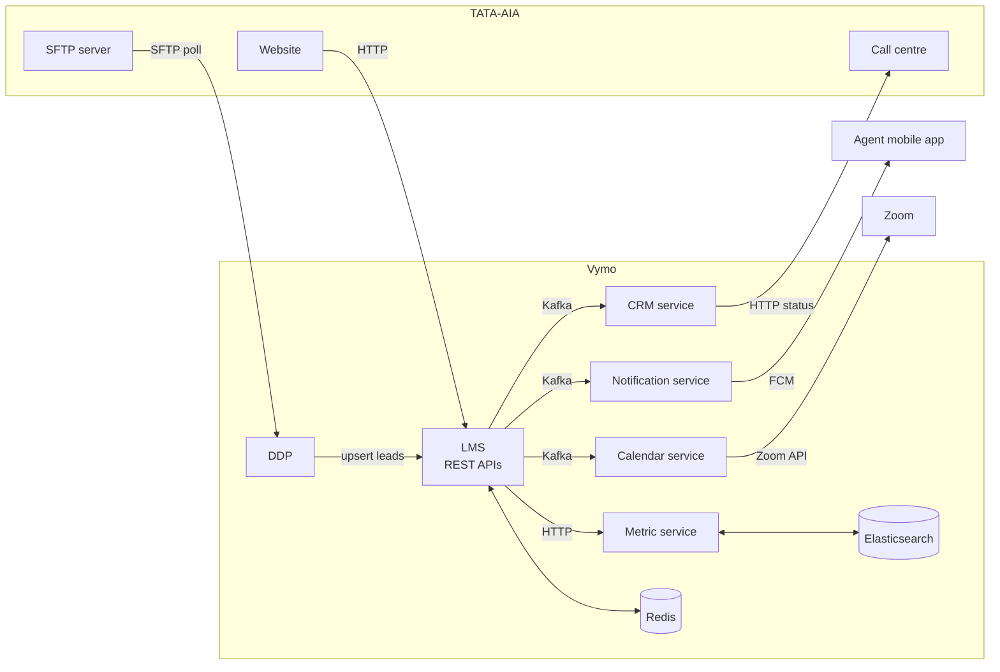
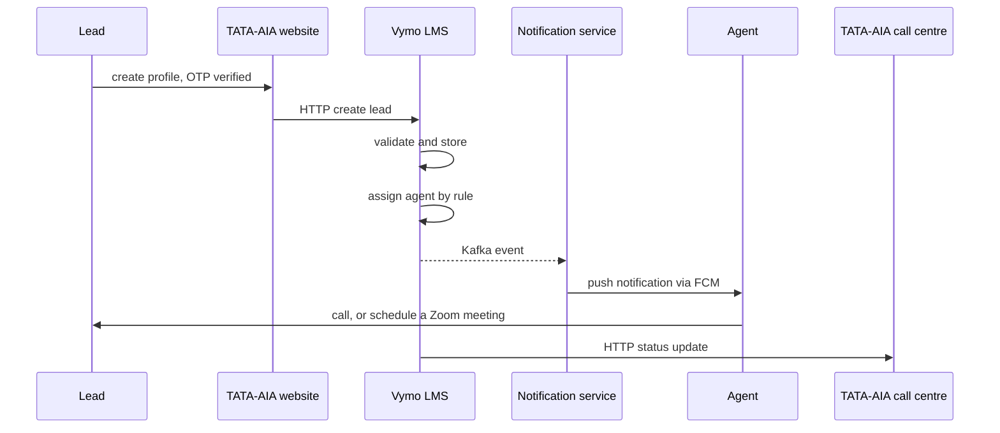

# High Level Design

> [!tldr]
> Two systems, seven services, one synchronous entry point and everything after it asynchronous over Kafka.

---

## Components

**TATA-AIA side**

| Component | Does |
| --- | --- |
| Website | customer facing app that captures the lead |
| SFTP server | receives the lead and officer files |
| SMS gateway APIs | sends SMS notifications |

**Vymo side**

| Component | Does |
| --- | --- |
| LMS, Lead Management System | the core service: stores, assigns and processes leads |
| DDP, Distributed Data Processing | asynchronous file processing |
| CRM service | agent interaction |
| Notification service | push notifications through Firebase |
| Calendar service | Zoom meeting scheduling |
| Metric service | Elasticsearch based search and analytics |

---

## Service contracts

| Source | Destination | Protocol | Purpose |
| --- | --- | --- | --- |
| TATA-AIA | Vymo LMS | HTTP | lead data creation |
| Vymo LMS | CRM service | Kafka | agent interaction |
| Vymo LMS | Notification service | Kafka | push notifications |
| Vymo LMS | Calendar service | Kafka | meeting scheduling |
| Vymo LMS | Metric service | HTTP | lead search |
| TATA-AIA call centre | Vymo CRM | HTTP | call centre update |
| Vymo DDP | SFTP | SFTP | lead file processing |

The pattern is worth naming: **HTTP where the caller needs an answer, Kafka where it does not.** Lead creation is HTTP because the website must know the lead was accepted. Notifying an agent is Kafka because nothing upstream depends on the outcome.

---

## Architecture

---

## The request sequence

In words: the lead creates a profile, the website posts it to LMS, LMS validates and creates the record, assigns it to an agent by predefined rules, the agent gets a push notification through FCM, the agent contacts the lead or books a Zoom meeting, and LMS reports the status back to the call centre.

> [!tip] Where the design earns the [[sli-slo-and-sla|SLA]]
> Everything the website waits for is on the left of the first Kafka arrow. Validation, storage and assignment are synchronous, and notification, scheduling and reporting are not. That split is what makes a 30 second end to end SLA achievable without making the website wait for a push notification to be delivered.
